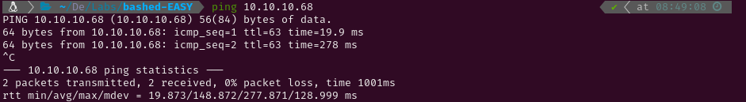

# EASY - BASHED

# 1. Enumeration

## 1.1 Open Ports

To determine the target's operating system, I initiated a ping test. The Time-To-Live (TTL) value returned was 63, indicating it was a Linux system (TTL values around 128 typically suggest a Windows OS). Following this, I conducted an Nmap scan to identify active services on the target using the `-p-` flag to scan all ports. Since this is a Hack The Box machine, I optimized the scan for speed with the following flags:

- `-min-rate 5000`
- `sS` (SYN scan)
- `T5` (maximum speed)




The scan revealed the following open ports:

- **HTTP** on port 80

Next, I performed a more detailed scan on port 80 with service version detection (`-sV`) and used the Nmap Scripting Engine (NSE) with default scripts (`-sC`). I saved the output for reference using the `-oN` flag.


## 1.2 Web Enumeration

After scanning for services, I utilized `whatweb` to identify the technologies used by the HTTP service. The web interface resembled a blog and displayed a tool called **phpbash**, which appeared to function as a web shell allowing command execution.There was an image where a directory path could be seen (`/uploads/phpbash.php`), but it was empty when accessed.

Subsequently, I executed the following command to enumerate directories on the web server: `gobuster dir -u [http://10.10.10.68](http://10.10.10.68/) -w /usr/share/wordlists/dirb/common.txt -o results.txt -x html,php,py,conf,txt,log,xml,sh`


This revealed several directories, all of which were empty or contained files that were not useful for further access, except for the `/dev/` directory which contained **phpbash.php**. I tested command execution and confirmed it ran under the **www-data** user. I then attempted to send a TCP reverse shell to my machine, which succeeded after URL encoding the `&` symbols (%26)


I visited all of them and they all were empty or had files that I couldn’t use to gain access to the system. All but the `/dev/` directory, which had the already mentioned tool phpbash. I tried writing commands and I found it ran them as the www-data user. So I tried sending a TCP revershe shell to my own system which finally worked when I URL encoded the &’s (%26).


# 2. Initial Access

After gaining access to the system, I spawned a fully upgraded TTY to maintain the connection more effectively. This was accomplished using the following commands:

```python
script /dev/null -c bash #Starts a new shell session without logging.
^Z #Pauses the new shell.
stty raw -echo;fg #Sets the terminal to raw mode, unsets echoing, and then brings the shell back.
reset #Resets the terminal to a sane state.
xterm #Sets the terminal type.
export TERM=xterm #Definition of necessary environment variables.
export SHELL=bash
stty rows 59 columns 116 #Definition of the window size.
```


With a stable TTY, I navigated to retrieve the user flag and then checked the sudo permissions. I discovered that I could execute commands as the user **scriptmanager**, prompting me to start a shell as that user.


# 3. Privilege Escalation

After switching users, I downloaded **pspy** to monitor the running processes. After observing for a while, I noted that the file `test.py` was executed periodically.


I located `test.py` by following its path to the `/scripts/` directory. Upon listing its contents, I found that the user **scriptmanager** owned `test.py`, which meant I could modify its contents to execute arbitrary commands as the user running it (UID=0, root).


To exploit this, I edited `test.py` to change the permissions of `/bin/bash` when the script was executed. This modification allowed me to run **bash** as its owner (root) after the next execution of `test.py`.


Finally, I was able to access the root user and capture the root flag.


