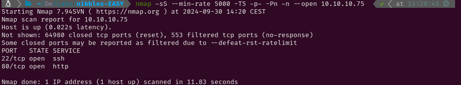

# EASY-NIBBLES -todo

# 1. Enumeration

## 1.1 Open Ports

To start the enumeration phase I conducted a Nmap scan to identify active services on the target using the `-p-` flag to scan all ports. Since this is a Hack The Box machine, I optimized the scan for speed with the following flags:

- `-min-rate 5000`
- `sS` (SYN scan)
- `T5` (maximum speed)



The scan revealed the following open ports:

- **SSH** on port 22
- **HTTP** on port 80

Next, I performed a more detailed scan with service version detection (`-sV`) and used the Nmap Scripting Engine (NSE) with default scripts (`-sC`). I saved the output for reference using the `-oN` flag.


## 1.2 Web Enumeration

After scanning for services, I utilized `whatweb` to identify the technologies used by the HTTP service. 


I also initiated a `gobuster` directory scan, which ran while I explored the website manually. However, the scan didn’t reveal any significant directories or files.


The homepage of the website displayed a simple *"Hello World!"* message. Upon inspecting the page's source code, I discovered a comment referencing a /nibbleblog/ directory: *"Nothing interesting here!"*


I manually navigated to /nibbleblog/, which revealed a blogging platform. At this point, I re-ran `gobuster` to search for additional hidden directories or files related to Nibbleblog, and this time it found something valuable.


# 2. Initial Access

The /admin.php directory led to the login panel for Nibbleblog's administration area.

I attempted to bypass the login form using SQL injection. I employed `BurpSuite` to automate and monitor the attempts. After several failed attempts, which were blocked due to rate-limiting, I finally succeeded in bypassing the authentication.

```

```


Once inside the admin panel, I identified the version of Nibbleblog in use. I searched for known vulnerabilities related to this version and came across [CVE-2015-6967](https://github.com/dix0nym/CVE-2015-6967/blob/main/exploit.py) which exploits an image upload feature in Nibbleblog's plugins to execute arbitrary PHP code. So I looked for the plugin manually and uploaded a php reverse shell ( [PentestMonkey PHP Reverse Shell](https://github.com/pentestmonkey/php-reverse-shell/blob/master/php-reverse-shell.php) ).


Once the reverse shell was uploaded I navigated to the plugin folder and executed it. This way I got access to the system.


After successfully uploading the PHP reverse shell, I navigated to the plugin folder and triggered the file to establish a reverse shell connection back to my system.

```python
script /dev/null -c bash #Starts a new shell session without logging.
^Z #Pauses the new shell.
stty raw -echo;fg #Sets the terminal to raw mode, unsets echoing, and then brings the shell back.
reset #Resets the terminal to a sane state.
xterm #Sets the terminal type.
export TERM=xterm #Definition of necessary environment variables.
export SHELL=bash
stty rows 59 columns 116 #Definition of the window size.
```

# 3. Privilege Escalation

With a stable TTY, I checked for available sudo permissions using the command `sudo -l`. I discovered that I had permission to execute a script named monitor.sh as the root user.  I located monitor.sh on the system and inspected its content. The script appeared to be a basic system monitoring tool, which I could edit since I had write permissions.


To exploit this, I modified monitor.sh to send a reverse shell back to my machine. By executing the script with sudo, the reverse shell was initiated with root privileges.


Finally, I was able to access the root user and capture the root flag.

