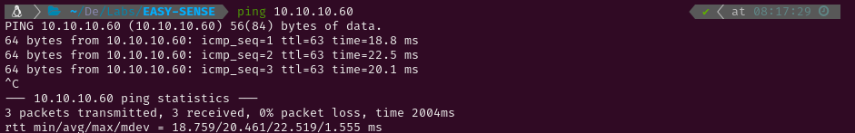

# EASY-SENSE

# 1. Enumeration

## 1.1 Open Ports

I started pinging the target to check if it was a Linux or a Windows system. The Time-To-Live (ttl) was 63, which is very close to 64, so it was a Linux system. Had it been close to 128 (or 128) it would have been a Windows system. After that I conducted an Nmap scan to detect active services on the target using `-p-` to scan all ports. Given that it was a Hack The Box machine (a controlled environment), I optimized the scan for speed using the following flags: `--min-rate 5000`, `-sS` for a SYN scan, `-Pn` to skip the host discovery stage, `-n` to skip reverse DNS resolution and `-T5` for higher speed.

The scan revealed the following open ports:

- **HTTP** on port 80
- **HTTPS** on port 443

Then, I conducted a more thorough scan to those two ports using service version detection (`-sV`) and the Nmap Scripting Engine (NSE) with default scripts (`-sC`). I also saved the output for easy reference later (`-oN nmap`).

## 1.2 Web Enumeration

After the scan I ran `whatweb` to check which technologies did the HTTPS service use and tried visiting the webpage to look for web vulnerabilities. The site presented a pfSense login panel. 

After some unsuccessful SQL injection attempts and trying default usernames and passwords, I ran `gobuster` to brute force directory paths. This yielded several results, but most required authentication to access. However, I did manage to access two files: `/changelog.txt` and `/system-users.txt`.

# 2. Gaining access

`/changelog.txt` contained some credentials which allowed me to log into the pfSense Dashboard. The dashboard indicated that the system was running version 2.1.3. Using `searchsploit`, I identified a known command injection vulnerability for this version of pfSense.

Upon reviewing the exploit script, I discovered that the vulnerability could be triggered via GET requests to `/status_rrd_graph_img.php?database=queues;`, allowing for arbitrary command injection. 

Knowing that, I tried injecting commands and I found that I couldn´t use some characters like `/` . However, I managed to use it printing the environment variable `$HOME` 

To gain more control over the target, I wrote a Python script to establish a reverse shell. I launched a netcat listener on port 6666, then served the Python script via the listener. By sending a netcat connection to my listener using `|python`, the server executed the script, providing me with a reverse shell.

Once connected, I achieved root access on the system and successfully retrieved both flags.

