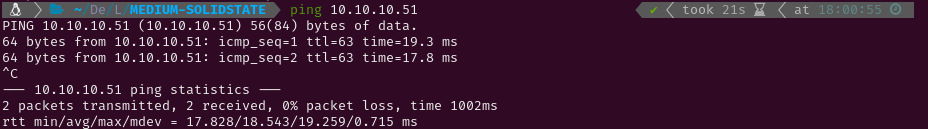

# MEDIUM - SOLIDSTATE

# 1. Enumeration

## 1.1 Open Ports

I started pinging the target to check if it was a Linux or a Windows system. The Time-To-Live (ttl) was 63, which is very close to 64, so it was a Linux system. Had it been close to 128 (or 128) it would have been a Windows system. After that I conducted an Nmap scan to detect active services on the target using `-p-` to scan all ports. Given that it was a Hack The Box machine (a controlled environment), I optimized the scan for speed using the following flags: `--min-rate 5000`, `-sS` for a SYN scan, `-Pn` to skip the host discovery stage, `-n` to skip reverse DNS resolution and `-T5` for higher speed.

The scan revealed the following open ports:

- **SSH** on port 22.
- **SMTP** on port 25
- **HTTP** on port 80
- **POP3** on port 110
- **NNTP** on port 119
- **RSIP** on port 4555

Then, I conducted a more thorough scan on those ports using service version detection (`-sV`) and the Nmap Scripting Engine (NSE) with default scripts (`-sC`). I also saved the output for easy reference later (`-oN nmap`).

## 1.2 Web Enumeration

After the scan I tried visiting the webpage to look for web vulnerabilities but the site only presented information about a cybersecurity company. However, I found a domain name in the Contact section that could be used to find sub-domains later.

Since the site didn’t provide any useful information, I decided to run **Gobuster** to brute-force directory paths. I started with the `common.txt` wordlist to quickly identify potential directories for further investigation. While analyzing those initial results, I initiated a second Gobuster scan using the more comprehensive `directory-list-2.3-medium.txt` wordlist, knowing it would take significantly longer to complete.

The `README.txt` file contained a message from the SolidState developer. SolidState is described as a fully responsive HTML5 and CSS3 site template, which didn’t appear to present any exploitable information.

## 1.3 Sub-domain Enumeration

I attempted to use `dig` to find the DNS server for the domain and then perform a zone transfer to retrieve subdomains, but the attempt was unsuccessful.

## 2 Gaining Access

Since I was unfamiliar with the RSIP service, I attempted to connect to it using netcat and discovered a login prompt, but I didn’t have the credentials. I searched for known vulnerabilities using **Searchsploit** and found two remote command execution scripts. While reviewing one of them, I came across what appeared to be the default credentials. I tried them and was able to log in successfully.

After gaining access, I discovered a command that allowed me to change passwords. I listed the users and modified their passwords, granting me the ability to read their emails through the `POP3` service. While reviewing the existing emails, I found one sent to the user `john` from `mailadmin`, instructing him to send a temporary password to `mindy`.

I then checked Mindy’s emails and found a welcome message from the company, along with the temporary credentials that John had sent her for SSH access: `mindy:P@55W0rd1!2@`.

Using those credentials, I connected via SSH and successfully retrieved the user flag.

Although I had access to the system, the shell was restricted to rbash (restricted Bash), limiting my access to most binaries. However, if non-interactive mode were misconfigured, I could run commands in that mode and spawn an interactive shell with Bash. I successfully exploited this misconfiguration, gaining an interactive shell that I could use to initiate the privilege escalation phase.

# 3. Privilege Escalation

In my attempt to check for any sudo permissions, I discovered that the `sudo` binary was missing. I then looked for files with SUID permissions that I could use to escalate privileges, but I didn’t find any that I recognized. I continued exploring other methods before investigating any of the files further.

I started a Python HTTP server to use `pspy32` on the target, allowing me to discover services running in the background. After some time, I identified a Python script (`tmp.py`) that was being executed periodically with root privileges, so I checked if I had write access to it. Since I had the necessary permissions, I modified the script to change the Bash permissions. Once the script was executed again, I used `bash -p` to obtain a shell with root privileges and retrieve the root flag.

