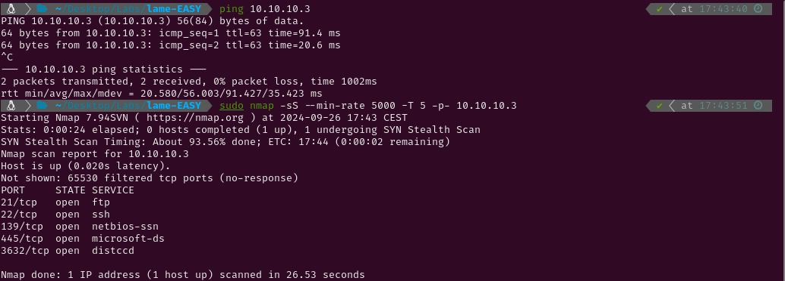

# EASY - LAME

# 1. Enumeration

I began by pinging the target machine to observe the TTL (Time-to-Live) value. Since it was close to 64, I identified it as a Linux system; had it been closer to 128, it would have indicated a Windows machine. Next, I conducted a Nmap scan to detect active services on the target. Given that this is a Hack The Box machine (a controlled environment), I optimized the scan for speed using the following flags: `--min-rate 5000`, `-sS` for a SYN scan, and `-T5` for maximum speed.



The scan has revealed the following open ports:

- **FTP** on port 21
- **SSH** on port 22
- **NetBios-ssn** on port 139
- **microsoft**-ds on port 445
- **distccd** on port 3632

 I conducted a thorough scan with service version detection (`-sV`) and the Nmap Scripting Engine (NSE) with default scripts (`-sC`). I also saved the output for easy reference later.


For now I know the machine has the following services running:

- FTP (File Transfer Protocol)
    - Service version → vsftpd 2.3.4
    - Anonymous login → allowed
- SSH (Secure Shell)
    - Service version → OpenSSH 4.7p1
- SMB with NetBios (Server Message Block with Network Basic Input Output System)
    - Service version → Samba smbd 3.0.20-Debian
- Distcc (tool that distributes the compilation workload between the computers in a network)
    - Service version → distccd v1

# 2. Exploitation

## FTP service

The Nmap script indicated that anonymous login was enabled. I attempted to explore the server for uploaded files but found none. 


 I then searched for known exploits targeting the vsftpd version. While a CVE exists for vsftpd 2.3.4, I was unable to obtain a shell using either Metasploit or various scripts from GitHub.


## **Distcc service**

Given that the version of distcc in use was vulnerable to arbitrary code execution, I attempted to exploit it using an NSE script. Since the target was vulnerable, I used the exploit script from GitHub [CVE-2004-2687](https://github.com/k4miyo/CVE-2004-2687/blob/k4miyo/CVE-2004-2687.py), successfully gaining access to the system as the `daemon` user. Afterward, I listed the home directories and retrieved the `user.txt` flag.


## **SMB service**

I ran `enum4linux` to gather as much information about the SMB service as possible. The output indicated access to the `/tmp` share, but after downloading and reviewing the files, I found nothing of value.


I then checked for known exploits targeting the version of Samba in use. The second result was a Metasploit script written in Ruby that appeared to allow command execution on the system. Instead of running the script blindly, I reviewed it first. The script exploits the login function by injecting commands using `/=` and backticks, which causes the server to execute whatever is contained within.


Nohup is a function that ensures a command is executed, even if the session is closed. So the server runs `nohup payload` being “payload” any command the user of the exploit wants.

I decided to manually replicate the exploit rather than relying on the automated Metasploit script. From inside the server, I used the logon ****command to execute the payload. I redirected the output of the exploit through Netcat back to my Kali, which provided me with a root shell.


The root.txt flag could be printed using `cat /root/root.txt` in the payload.


Had further exploration of the system been needed, I could have also sent a shell through netcat to my own system.


Additionally, I could have spawned a fully upgraded tty using the following commands

```python
script /dev/null -c bash
export TERM="xterm"
export SHELL="bash"
^Z  #Press ctrl + z
stty raw -echo;fg
reset xterm
stty rows 44 columns 184
```


